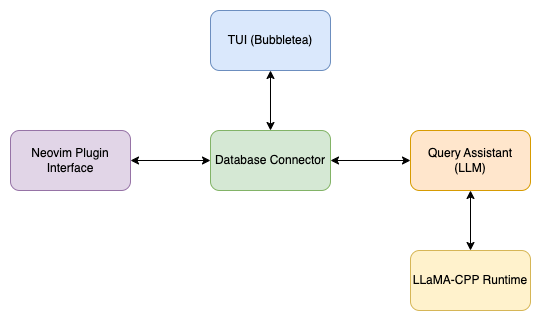

# Database Management Tool Design Document

## 1. Introduction

### 1.1 Purpose

This document outlines the high-level design for a terminal-based database management tool with TUI, supporting multiple database types, and featuring an embedded language model for query assistance.

### 1.2 Scope

The tool will support relational, NoSQL, and document databases, provide a TUI interface, integrate a small language model for query generation, and offer Neovim plugin capabilities.

### 1.3 Definitions, Acronyms, and Abbreviations

- TUI: Terminal User Interface
- GGUF: GPT-Generated Unified Format
- LLM: Large Language Model

## 2. System Overview

### 2.1 System Architecture

The system consists of five main components:

- TUI (Text User Interface)
- Database Connector
- Query Assistant (LLM)
- [LLaMA-CPP](https://github.com/ggerganov/llama.cpp) Runtime
- [Neovim](https://neovim.io/) Plugin Interface

### 2.2 System Description

A Go-based application providing a terminal interface for managing various database types. It includes an embedded LLM to assist with query generation and can integrate with Neovim as a plugin.

## 3. Design Considerations

### 3.1 Assumptions and Dependencies

- Go 1.17 or later
- [LLaMA-CPP](https://github.com/ggerganov/llama.cpp) for LLM runtime
- Access to various database systems for testing

### 3.2 General Constraints

- Must be stateless
- Should work across different operating systems
- Minimal external dependencies

### 3.3 Goals and Guidelines

- User-friendly TUI
- Extensible for future database types
- Efficient query assistance
- Seamless [Neovim](https://neovim.io/) integration

## 4. Architectural Strategies

### 4.1 TUI Implementation

- Utilize [github.com/charmbracelet/bubbletea](https://github.com/charmbracelet/bubbletea) for TUI
- Implement a modular design for easy feature addition

### 4.2 Database Integration

- Create interfaces for different database types
- Use appropriate Go drivers for each database type

### 4.3 Language Model Integration

- Train model using Python tools (e.g., [PyTorch](https://pytorch.org/), [Hugging Face](https://huggingface.co))
- Export model to [GGUF](https://en.wikipedia.org/wiki/Llama.cpp#GGUF_file_format) format
- Use [LLaMA-CPP](https://github.com/ggerganov/llama.cpp)'s HTTP server or CLI for inference

### 4.4 Neovim Plugin

- Develop Lua script for Neovim integration
- Implement communication between Neovim and the Go application

## 5. System Architecture

### 5.1 Component Diagrams

### 5.2 Interface Descriptions

- TUI: User interaction point
- Database Connector: Manages connections to various databases
- Query Assistant: Provides LLM-based query suggestions
- LLaMA-CPP Runtime: Executes the LLM
- Neovim Plugin Interface: Enables integration with Neovim

## 6. Policies and Tactics

### 6.1 Security

- Implement secure storage for database credentials
- Ensure secure communication with databases

### 6.2 Performance

- Optimize LLM inference for quick query suggestions
- Efficient database query execution and result display

## 7. Detailed System Design

### 7.1 TUI Module

- Main screen layout
- Database selection interface
- Query input and result display areas

### 7.2 Database Connector Module

- Interface for database operations
- Implementations for SQL, NoSQL, and document databases

### 7.3 Query Assistant Module

- LLM integration for query suggestions
- User interaction for refining suggestions

### 7.4 LLaMA-CPP Integration

- HTTP server setup or CLI invocation
- Request/response handling

### 7.5 Neovim Plugin Module

- Lua script for Neovim
- Communication protocol with main application

## 8. Alternatives Considered

### 8.1 TUI Libraries

a) [github.com/rivo/tview](https://github.com/rivo/tview)

Pros:

- High-level API for complex layouts
- Rich text support
- Extensive widget library

Cons:

- May be overkill for simpler interfaces
- Less fine-grained control

b) [github.com/jroimartin/gocui](https://github.com/jroimartin/gocui)

Pros:

- Low-level, offering fine-grained control
- Lightweight
- Close to traditional ncurses experience

Cons:

- More complex to use for advanced layouts
- Less built-in widgets

c) [github.com/charmbracelet/bubbletea](https://github.com/charmbracelet/bubbletea) **(chosen)**

Pros:

- Modern, composable architecture
- Growing ecosystem of components
- Elegant handling of state and updates

Cons:

- Different paradigm (Elm-inspired) with potential learning curve
- Relatively newer, may have fewer examples/resources

### 8.2 Database Connectivity

a) Use separate drivers for each database type **(chosen)**

Pros:

- Native performance for each database
- Full access to database-specific features

Cons:

- More code to maintain
- Potential inconsistencies across implementations

b) Use a universal database adapter (e.g., [ODBC](https://en.wikipedia.org/wiki/Open_Database_Connectivity))

Pros:

- Single interface for multiple databases
- Potentially easier to add new database support

Cons:

- May not support all database-specific features
- Potential performance overhead
- Limited support for NoSQL databases

### 8.3 LLM Integration

a) Direct integration with [LLaMA-CPP](https://github.com/ggerganov/llama.cpp) using [CGo](https://pkg.go.dev/cmd/cgo)

Pros:

- Potentially faster execution
- Tighter integration with Go code

Cons:

- Complicates build process
- Risk of breaking changes affecting Go code

b) Use [LLaMA-CPP](https://github.com/ggerganov/llama.cpp)'s HTTP server or CLI **(chosen)**

Pros:

- Cleaner separation of concerns
- Easier to swap out for other models in the future
- Simpler Go code, no CGo required

Cons:

- Slight performance overhead due to HTTP/process communication
- Requires managing a separate process

### 8.4 LLM Training

There just aren't any mature tools available for LLM training in Go, so we're going to go with Python

a) Train in Python using [PyTorch](https://pytorch.org/) **(chosen)**

Pros:

- Dynamic computation graph: PyTorch builds the computational graph as you execute the code, making it more intuitive and easier to debug. This is particularly useful for research and prototyping, where flexibility and quick iteration are essential.
- Pythonic: PyTorch feels more like native Python code, making it easier to learn and use for those familiar with the language.
- Strong community: PyTorch has a rapidly growing community, especially among researchers, leading to excellent support and a wealth of tutorials and resources.

Cons:

- Scalability: While PyTorch can scale to large datasets and models, TensorFlow might be better optimized for very large-scale deployments.
- Introduces another language to the project

b) Train in Python using [TensorFlow](https://www.tensorflow.org/)

Pros:

- Scalability: TensorFlow is designed for scalability and performance, making it suitable for large-scale applications and production environments.
- Deployment: TensorFlow offers a wide range of deployment options, including TensorFlow Serving, TensorFlow Lite for mobile and embedded devices, and support for various cloud platforms.
- Mature ecosystem: TensorFlow has a larger and more established community, providing extensive resources, documentation, and support.

Cons:

- Static computation graph: TensorFlow traditionally used a static computation graph, which can be less intuitive for debugging and prototyping. However, TensorFlow 2.0 introduced eager execution, bridging the gap with PyTorch's dynamic approach.
- Steeper learning curve: TensorFlow's syntax and structure can be more complex, especially for beginners.
- Introduces another language to the project

### 8.5 Neovim Integration

a) Develop as a native [Neovim](https://neovim.io/) plugin in [Lua](https://neovim.io/doc/user/lua.html) **(chosen)**

Pros:

- Direct access to Neovim API
- Better performance for editor interactions

Cons:

- Not compatible with vanilla [VIM](https://www.vim.org/)

b) Use a generic editor integration approach (e.g., [Language Server Protocol](https://en.wikipedia.org/wiki/Language_Server_Protocol))

Pros:

- Could potentially work with multiple editors
- Standardized protocol

Cons:

- May not be able to leverage Neovim-specific features
- Overhead of LSP may be unnecessary for this use case

## 9. Appendices

### 9.1 Technology Stack

- Go for main application
- Python for LLM training
- LLaMA-CPP for LLM runtime
- Bubbletea for TUI
=======
   1.1 Purpose
       This document outlines the high-level design for a terminal-based database management tool with TUI, supporting multiple database types, and featuring an embedded language model for query assistance.

   1.2 Scope
       The tool will support relational, NoSQL, and document databases, provide a TUI interface, integrate a small language model for query generation, and offer Neovim plugin capabilities.

   1.3 Definitions, Acronyms, and Abbreviations
       - TUI: Terminal User Interface
       - GGUF: GPT-Generated Unified Format
       - LLM: Large Language Model

## 2. System Overview
   2.1 System Architecture
       The system consists of five main components:
       1. TUI
       2. Database Connector
       3. Query Assistant (LLM)
       4. LLaMA-CPP Runtime
       5. Neovim Plugin Interface

   2.2 System Description
       A Go-based application providing a terminal interface for managing various database types. It includes an embedded LLM to assist with query generation and can integrate with Neovim as a plugin.

## 3. Design Considerations
   3.1 Assumptions and Dependencies
       - Go 1.x or later
       - LLaMA-CPP for LLM runtime
       - Access to various database systems for testing

   3.2 General Constraints
       - Must be stateless
       - Should work across different operating systems
       - Minimal external dependencies

   3.3 Goals and Guidelines
       - User-friendly TUI
       - Extensible for future database types
       - Efficient query assistance
       - Seamless Neovim integration

## 4. Architectural Strategies
   4.1 TUI Implementation
       - Utilize github.com/charmbracelet/bubbletea for TUI
       - Implement a modular design for easy feature addition

   4.2 Database Integration
       - Create interfaces for different database types
       - Use appropriate Go drivers for each database type

   4.3 Language Model Integration
       - Train model using Python tools (e.g., PyTorch, Hugging Face)
       - Export model to GGUF format
       - Use LLaMA-CPP's HTTP server or CLI for inference

   4.4 Neovim Plugin
       - Develop Lua script for Neovim integration
       - Implement communication between Neovim and the Go application

## 5. System Architecture
   5.1 Component Diagrams
       [Include a basic component diagram here]

   5.2 Interface Descriptions
       - TUI: User interaction point
       - Database Connector: Manages connections to various databases
       - Query Assistant: Provides LLM-based query suggestions
       - LLaMA-CPP Runtime: Executes the LLM
       - Neovim Plugin Interface: Enables integration with Neovim

## 6. Policies and Tactics
   6.1 Security
       - Implement secure storage for database credentials
       - Ensure secure communication with databases

   6.2 Performance
       - Optimize LLM inference for quick query suggestions
       - Efficient database query execution and result display

## 7. Detailed System Design
   7.1 TUI Module
       - Main screen layout
       - Database selection interface
       - Query input and result display areas

   7.2 Database Connector Module
       - Interface for database operations
       - Implementations for SQL, NoSQL, and document databases

   7.3 Query Assistant Module
       - LLM integration for query suggestions
       - User interaction for refining suggestions

   7.4 LLaMA-CPP Integration
       - HTTP server setup or CLI invocation
       - Request/response handling

   7.5 Neovim Plugin Module
       - Lua script for Neovim
       - Communication protocol with main application

## 8. Alternatives Considered

   8.1 TUI Libraries
       a) github.com/rivo/tview
          Pros:
          - High-level API for complex layouts
          - Rich text support
          - Extensive widget library
          Cons:
          - May be overkill for simpler interfaces
          - Less fine-grained control

       b) github.com/jroimartin/gocui
          Pros:
          - Low-level, offering fine-grained control
          - Lightweight
          - Close to traditional ncurses experience
          Cons:
          - More complex to use for advanced layouts
          - Less built-in widgets

       c) github.com/charmbracelet/bubbletea (chosen)
          Pros:
          - Modern, composable architecture
          - Growing ecosystem of components
          - Elegant handling of state and updates
          Cons:
          - Different paradigm (Elm-inspired) with potential learning curve
          - Relatively newer, may have fewer examples/resources

   8.2 Database Connectivity
       a) Use separate drivers for each database type (chosen)
          Pros:
          - Native performance for each database
          - Full access to database-specific features
          Cons:
          - More code to maintain
          - Potential inconsistencies across implementations

       b) Use a universal database adapter (e.g., ODBC)
          Pros:
          - Single interface for multiple databases
          - Potentially easier to add new database support
          Cons:
          - May not support all database-specific features
          - Potential performance overhead
          - Limited support for NoSQL databases

   8.3 LLM Integration
       a) Direct integration with LLaMA-CPP using CGo
          Pros:
          - Potentially faster execution
          - Tighter integration with Go code
          Cons:
          - Complicates build process
          - Risk of breaking changes affecting Go code

       b) Use LLaMA-CPP's HTTP server or CLI (chosen)
          Pros:
          - Cleaner separation of concerns
          - Easier to swap out for other models in the future
          - Simpler Go code, no CGo required
          Cons:
          - Slight performance overhead due to HTTP/process communication
          - Requires managing a separate process

   8.4 LLM Training
       a) Train in Go using libraries like GoML
          Pros:
          - Consistent language throughout the project
          - Potential for easier integration
          Cons:
          - Limited ML ecosystem compared to Python
          - Fewer pre-trained models and tools available

       b) Train in Python using PyTorch or TensorFlow (chosen)
          Pros:
          - Rich ecosystem of ML tools and libraries
          - Vast array of pre-trained models available
          - More resources and community support for ML in Python
          Cons:
          - Introduces another language to the project
          - Requires exporting model for use in Go application

   8.5 Neovim Integration
       a) Develop as a native Neovim plugin in Lua (chosen)
          Pros:
          - Direct access to Neovim API
          - Better performance for editor interactions
          Cons:
          - Requires learning Lua for plugin development

       b) Use a generic editor integration approach (e.g., Language Server Protocol)
          Pros:
          - Could potentially work with multiple editors
          - Standardized protocol
          Cons:
          - May not be able to leverage Neovim-specific features
          - Overhead of LSP may be unnecessary for this use case

## 9. Appendices
   9.1 Technology Stack
       - Go for main application
       - Python for LLM training
       - LLaMA-CPP for LLM runtime
       - Bubbletea for TUI

